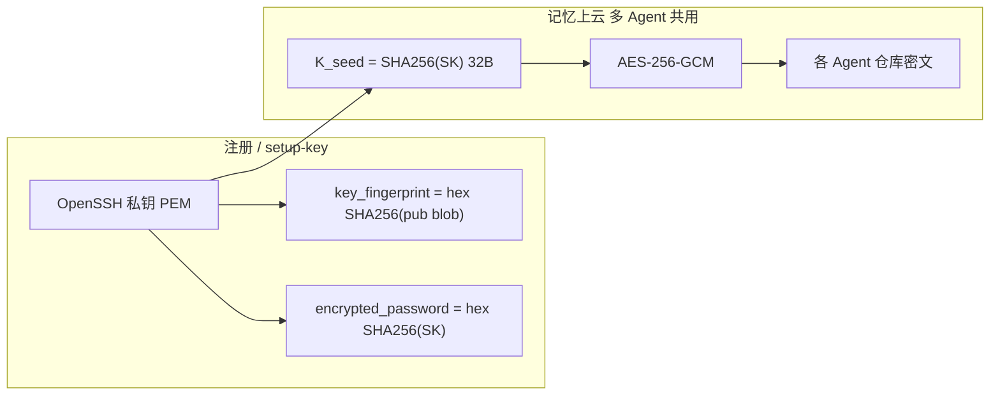

# mindmemory-client 库设计

本文档定义 **mindmemory-client** 的职责边界、架构与对外 API 形态，以及配套 **CLI 外接程序**的设计，供实现与上层集成（如 `openclaw-mmem` 等 Claw 插件）及**无 Claw 环境下的联调**参考。依据：

- MindMemory：`mindmemory/docs/mmem.md`、`mindmemory/docs/mmem-web-api.md`
- PNMS：`pnms/docs/pnms_api.md`、`pnms/docs/pnms.md`

---

## 1. 定位与目标

### 1.1 一句话

**mindmemory-client** 是运行在「客户端侧」的 Python 库：在本地调用 **PNMS** 完成神经记忆引擎能力，并通过 **MindMemory Web API**（`/api/v1`）完成账户、用户信息与 **Git 同步锁**（begin-submit / mark-completed）等与服务端的协作；**不绑定任何具体 Claw/OpenClaw 运行时**。

### 1.2 解决的问题

| 层次 | 职责 |
|------|------|
| PNMS | 单用户/多用户下的记忆槽、图、概念模块与 `handle` / `get_context` 等（见 PNMS 文档）。 |
| MindMemory 服务端 | Git 驱动密文仓库、元数据、`sync` 锁与队列（见 MMEM 文档）。 |
| **mindmemory-client（本库）** | 把 PNMS 的 `user_id` 策略、本地数据目录约定与 MMEM 的 **HTTP + Ed25519 签名** 封装成稳定 API，避免每个插件重复实现签名字符串、payload 格式与错误分类；支持「当前轮对话 + 长期记忆上下文」一并交给 LLM 的编排接口（见 5.3、第 10 节）。 |
| **配套 CLI（见第 10 节）** | 不依赖 Claw：本地对话调试 PNMS + mindmemory-client + MindMemory；并可演进为**官方命令行客户端**（配置、健康检查、可选 Git 同步演练）。 |
| 具体 Claw 插件（如 openclaw-mmem） | Workspace 路径、Hooks/Tools、Git 工作副本、`git push` 分支名、`MEMORY.md` 等**产品层**逻辑。 |

### 1.3 非目标

- 不实现 OpenClaw/Claw 插件注册、不依赖任何 Gateway SDK。
- **不替代**本地 Git 操作：克隆、提交、`git push` 仍由调用方（插件或 CLI）执行；本库只负责 **sync API 的调用顺序与签名**，并与 PNMS 生命周期对齐（见第 5 节）。
- 不要求服务端解析 PNMS 明文；与 MMEM「零知识」原则一致。

---

## 2. 架构关系

```text
   ┌────────────────────────────┐       ┌──────────────────────────────┐
   │ Claw 插件（openclaw-mmem）  │       │ 配套 CLI（mmem-cli，第 10 节） │
   │ · workspace / git / 加密     │       │ · 无 Claw 联调、自有终端客户端  │
   └──────────────┬─────────────┘       └──────────────┬───────────────┘
                  │ 依赖                              │ 依赖
                  └──────────────────┬─────────────────┘
                                     ▼
┌─────────────────────────────────────────────────────────────┐
│  mindmemory-client（本库）                                    │
│  · PNMSClient 封装 + 每 Agent 数据目录                         │
│  · MMEMClient：/api/v1/auth、/me、/agents、/sync/*           │
│  · SyncSigner：Ed25519 payload 与集成测试一致的结构化 JSON      │
│  · 对话轮：检索记忆上下文 + 本轮 user 内容 → 供 LLM 使用        │
└───────────────┬─────────────────────────────┬───────────────┘
                │                             │
                ▼                             ▼
         ┌──────────────┐              ┌──────────────────┐
         │  pnms 包     │              │ MindMemory HTTP  │
         │  (本地推理)   │              │ Base: /api/v1    │
         └──────────────┘              └──────────────────┘
```

---

## 3. 依赖与运行环境

- **Python**：与 `pnms`、`mindmemory` 后端联调时建议 3.10+。
- **必选依赖**（实现时以 `pyproject.toml` 为准）：
  - `pnms`：可编辑安装或版本约束由 monorepo 锁定。
  - `httpx`：异步/同步 HTTP 客户端。
  - `cryptography`：Ed25519 签名（与 `mindmemory/tests/test_integration_flow.py` 一致）。
  - `pydantic`：请求/响应模型（与 FastAPI 侧字段对齐）。
- **可选**：`pydantic-settings` 用于从环境变量加载默认 Base URL 等。

---

## 4. 配置模型

建议提供统一配置对象（名称可为 `MindMemoryClientConfig`），字段包括但不限于：

| 字段 | 说明 |
|------|------|
| `base_url` | MindMemory 服务根 URL（不含路径时拼接 `/api/v1`）。 |
| `user_uuid` | 注册后在 Web 获取，写入插件配置；PNMS 侧可与目录名组合使用。 |
| `private_key` / `private_key_path` | Ed25519 私钥，用于 `sync` 接口的 `payload` + `signature`；与 MMEM 存库的公钥对应。 |
| `pnms_data_root` | 本库管理的 PNMS 检查点根目录；**按 Agent 分子目录**（见 6.2）。 |
| `pnms_config` | `PNMSConfig` 或 `dict`，传入前可 `validate()`。 |
| `timeout_s` | HTTP 超时。 |

环境变量前缀建议：`MMEM_`（与后端、测试习惯一致，如 `MMEM_BASE_URL`）。

---

## 5. 模块划分（建议包结构）

### 5.1 `mindmemory_client.http` — MMEM REST 封装

封装 `mmem-web-api.md` 中与客户端相关的接口（路径前缀 `/api/v1`）：

| 能力 | 方法 | 备注 |
|------|------|------|
| 注册 / 登录 / 上传公钥 | `POST .../auth/register`、`login`、`setup-key` | 可选；多数场景由用户在 Web 完成，库提供函数便于 CLI。 |
| 当前用户 | `GET .../me`，Header `X-User-UUID` | |
| Agent 列表 | `GET .../agents` | |
| 开始提交 | `POST .../sync/begin-submit` | Body 含 `user_uuid`, `agent_name`, `payload`, `signature` |
| 标记完成 | `POST .../sync/mark-completed` | Body 含 `lock_uuid`, `commit_ids`, `submission_ok` 等 |

响应体使用 Pydantic 模型解析，**HTTP 4xx/5xx** 映射为本库异常类型（如 `MindMemoryAPIError`，带 `status_code` 与 `detail`），便于插件区分 **409 同步冲突** 与 **401 签名校验失败**。

### 5.2 `mindmemory_client.sync` — 签名与 payload 约定

与 `mindmemory/tests/test_integration_flow.py` **保持一致**的 JSON 字符串格式（字段顺序与引号需与测试一致，避免服务端验签失败）：

- **begin-submit**  
  `{"ts":<unix>,"op":"begin-submit","user_uuid":"<uuid>","agent":"<agent_name>"}`

- **mark-completed**  
  `{"ts":<unix>,"op":"mark-completed","user_uuid":"<uuid>","agent":"<agent_name>","lock_uuid":"<uuid>","commit":"<commit_sha>"}`

说明：

- `signature`：对 **整段 payload 字符串** UTF-8 字节做 Ed25519 签名后 **Base64**（与现有测试一致）。
- `holder_info`：可透传为调用方主机名或实例 ID（`BeginSubmitBody.holder_info`）。

导出函数示例（命名可调整）：

- `build_begin_submit_payload(user_uuid, agent_name, ts: int | None) -> str`
- `build_mark_completed_payload(user_uuid, agent_name, lock_uuid, commit_id, ts: int | None) -> str`
- `sign_payload(payload: str, private_key) -> str`

### 5.3 `mindmemory_client.pnms` — PNMS 托管封装

职责：

- 持有（或懒建）**全局 `PNMSConfig`** 与 **`PNMSClient`** 实例。
- 为每个逻辑隔离单元（推荐：**同一 `user_uuid` 下的一个 `agent_name`**）分配：
  - **PNMS `user_id` 字符串**：建议 `f"{user_uuid}::{agent_name}"` 或仅 `agent_name` 在单用户进程内（需在文档中固定一种，避免跨用户冲突）。
  - **持久化目录**：`{pnms_data_root}/{safe_segment(user_uuid)}/{safe_segment(agent_name)}/`，其下存放 PNMS 的 `concept_checkpoint_dir`、`graph.db` 等（见 PNMS `save_concept_modules`）。

对外暴露高层方法（与 `pnms/docs/pnms_api.md` 对齐）：

- `handle_turn(user_id, query, llm, content_to_remember=..., system_prompt=...)` → `HandleQueryResult`
- `get_context(user_id, query, system_prompt=..., use_concept=...)` → `ContextResult`
- `save_checkpoint(user_id)`：对应引擎的 `save_concept_modules()`（在适当时机由调用方或本库钩子触发）。

**不**在本层做：从 OpenClaw workspace 读文件；该部分属于插件。

### 5.4 `mindmemory_client.session`（可选）— 同步事务式编排

提供「**开始提交 →（调用方执行 Git 与文件写入）→ 标记完成**」的薄封装，避免插件漏调 `mark-completed`：

- `begin_submit(agent_name, holder_info=None) -> BeginSubmitResult`（含 `lock_uuid`, `last_commit_id`, `agent_created` 等）。
- `mark_completed(agent_name, lock_uuid, submission_ok, commit_ids, error_message=None)`。

**不**在本层执行 `subprocess` 调用 git；仅保证 API 顺序与锁字段传递正确。

---

## 6. 与上层插件的协作契约

### 6.1 典型 Push 流程（与 MMEM `mmem.md` 3.3 节一致）

1. 调用本库 **`begin_submit`**（或等效 HTTP + 签名），拿到 `lock_uuid`；若 **409**，由插件策略等待/重试。
2. 插件在本地：合并 PNMS 产出、加密、**git commit**、`git push <remote> <memory_schema_version>`（分支名由插件/schema 决定，**不在本库硬编码**）。
3. 成功则调用 **`mark_completed`**（`submission_ok=True`, `commit_ids=[...]`）；失败则 `submission_ok=False` 并填 `error_message`。
4. 可选：在步骤前后调用 PNMS `save_checkpoint`，避免进程崩溃丢失本地神经状态。

### 6.2 PNMS 与 Agent 隔离

- **云端**：MindMemory 以 `user_uuid` + `agent_name` 区分 Agent 与仓库。
- **本地 PNMS**：必须为不同 `agent_name` 使用不同 `user_id` 或不同数据目录，避免槽/图串库；本库在 `pnms` 子模块中强制执行该约定。

### 6.3 错误与重试策略（建议）

| 场景 | 建议 |
|------|------|
| `begin-submit` 409 | 说明他端持有锁或队列忙；退避后重试或提示用户。 |
| `mark-completed` 409 | 锁过期或 `lock_uuid` 不匹配；需重新 `begin-submit`。 |
| 401 on sync | 检查公钥是否已上传、`payload` 是否与私钥匹配、时间戳是否过旧（若服务端未来加时效校验）。 |

---

## 7. 安全说明

- 私钥**仅存在于客户端**配置或密钥链；本库只接收内存中的私钥对象或路径，**日志中不得打印**私钥与完整 `signature`。
- `payload` 为明文 JSON 字符串，仅用于签名与传输；不含记忆正文。
- 与 MMEM 设计一致：记忆密文通过 Git 传输，服务端不解析 PNMS 明文。
- **注册与记忆密钥材料**见 **第 11 节**（`encrypted_password`、`key_fingerprint` 与 `gen_register_bundle.py` 的 SHA-256 约定；记忆载荷 AES-256-GCM）。

---

## 8. 测试策略

- **单元测试**：payload 字符串与 `test_integration_flow.py` 中格式逐字一致；签名后对 mock 公钥可本地验签。
- **集成测试**（可选，`MMEM_INTEGRATION=1`）：复用 mindmemory 仓库已有流程，本库作为客户端替换内联 `httpx` 调用。
- **CLI（第 10 节）**：作为**人工与半自动联调入口**——在不启动 Claw 的情况下验证「PNMS 长期记忆 → 与当前轮对话拼接 → LLM → 写回记忆」全链路，以及 MindMemory 连通性、同步锁与（可选）Git 推送流程。

---

## 9. 版本与文档

- 库版本号独立于 `openclaw-mmem`；破坏性变更时在 CHANGELOG 标明。
- CLI 与 `mindmemory-client` 建议**同仓库、版本联动**（CLI 仅作薄封装，核心逻辑仍在库内）。
- 本设计文档随实现迭代更新；**不在用户未要求时**额外生成无关说明文件。

---

## 10. 配套 CLI 外接程序设计（`mmem-cli`）

本节描述随 **mindmemory-client** 提供的命令行程序（工作名 **`mmem-cli`**，可执行入口建议 `mmem` 或 `mmem-cli`）。它**仅依赖 mindmemory-client**（进而依赖 PNMS、HTTP 客户端等），**不依赖** OpenClaw / 任意 Claw Gateway。

### 10.0 CLI 主功能（核心闭环）

CLI 的**首要用途**是一条清晰闭环，其余命令（如 `doctor`、手动 `sync` 子命令）均为辅助联调或进阶操作：

1. **与后端 LLM 聊天**：多轮或单次对话，由 CLI 的 LLM 适配层调用用户配置的模型（Ollama、OpenAI 兼容 API、mock 等）。
2. **在聊天过程中生成并更新记忆**：每一轮通过 PNMS（经 mindmemory-client）根据当前 query 检索/构建上下文、在得到模型回复后更新神经状态与记忆槽等，使「对话中产生的可巩固信息」进入**本地长期持久化**表示。
3. **同步到 MindMemory**：在适当时机（例如每轮后、退出前或显式触发）将符合 MMEM 流程的提交与 **begin-submit / mark-completed**（及配套的本地加密 + Git 推送，与 `mmem.md` 一致）执行完毕，使密文与元数据进入服务端，与插件路径对齐。

概括：**聊天是主路径，记忆随对话持续写入 PNMS，再同步到 MindMemory**；不是「先只做同步工具、聊天可有可无」。

### 10.1 双重目标（主功能之外的定位）

| 目标 | 说明 |
|------|------|
| **联调与调试** | 在未接入具体 Claw 实例时，本地验证 **PNMS 持久化**、**mindmemory-client** 编排、**MindMemory** 服务端（健康、鉴权、`/sync`）整条链路；可切换「仅本地 PNMS」与「PNMS + 远端 MMEM」模式。 |
| **自有客户端** | 同一套 CLI 可作为面向终端用户的**官方轻量客户端**：配置账号与密钥、多 Agent 会话、对话与可选云端同步，与 Claw 插件并存、能力子集可先行（例如先发 `chat` + `doctor`，后发完整 Git 同步）。 |

### 10.2 在对话链路中的位置（与库职责对齐）

**mindmemory-client** 的核心体验是：**长期持续化记忆（PNMS）** 在每一轮与 **LLM** 交互时，先生成**与当前对话相符**的上下文（检索槽、图、概念等），再与**本轮用户输入**一起进入 LLM；对话结束后将值得巩固的内容写回 PNMS，并在需要时走 MMEM 同步。

CLI 不改变该语义，只做**终端侧的胶水**：

1. 读取用户输入（REPL 或 `-m` 单次）。
2. 调用 mindmemory-client：**`handle_turn`**（或等价：`get_context` + 外层再调 LLM，由库是否提供「一站式」决定实现细节）。
3. **LLM 适配层**（CLI 内）：将 `(system_prompt, pnms_context, user_message)` 拼成上游请求；支持 **mock**（回显/固定串）、**子进程/HTTP**（Ollama、OpenAI 兼容 API 等），便于无密钥离线调试。
4. 将本轮 `content_to_remember`（可由 CLI 规则生成，例如「用户问/答摘要」或显式 `--remember`）交给 PNMS 更新路径。
5. 可选：会话结束或 `--sync` 时触发 **begin-submit →（本地加密 + git，若实现）→ mark-completed**，与第 6 节一致。

```text
用户输入 ──► mindmemory-client（PNMS 检索/更新）
                │
                ├─► context + 本轮 query ──► CLI.LLM 适配层 ──► 模型回复
                │
                └─► 持久化 checkpoint；可选 MMEM /sync
```

### 10.3 建议工程形态

- **位置**：与 `mindmemory_client` 同仓库，例如 `mmem_cli/` 包或 `src/mmem_cli`，在 `pyproject.toml` 中注册 `project.scripts`：`mmem = "mmem_cli.main:app"`（若用 Typer/Click）。
- **依赖**：`mindmemory-client`（workspace 可编辑安装）、终端增强可选 `rich`、`typer` 或 `click`；**不**把 OpenClaw 列入依赖。
- **配置**：与第 4 节共用环境变量与配置文件；CLI 可额外支持 `--profile` 或 `~/.config/mmem/config.toml`（路径仅作建议，实现时统一一种）。

### 10.4 命令谱系（建议）

实现可分阶段；下列为完整愿景，便于一次性设计、迭代交付。

| 命令 | 作用 |
|------|------|
| `mmem doctor` | 检查 Python 版本、pnms 可导入、`MMEM_BASE_URL` 可达、`/health`、私钥与 `user_uuid` 是否可读（不落盘打印密钥）。 |
| `mmem config path` | 打印当前生效配置路径与来源（env / 文件）。 |
| `mmem chat` | 进入交互式对话；每轮走 10.2 节流程；支持 `--agent <name>` 与 `--user-id`（PNMS 逻辑用户，默认与配置一致）。 |
| `mmem chat -m "..."` | 单次提问后退出，适合脚本与 CI 烟测。 |
| `mmem chat --no-remote` | 仅本地 PNMS + LLM，不调用 MindMemory HTTP（调试 PNMS 与 prompt 拼接）。 |
| `mmem sync status` | 调用 `GET /me`、`GET /agents`（需 Header），展示远端可见的 Agent 与锁无关的只读信息。 |
| `mmem sync begin` / `mmem sync done` | 显式调用 begin-submit / mark-completed（供调试 sync，不强制做 git）。 |
| `mmem sync push`（可选，后期） | 在 CLI 内封装「加密产物 + git worktree」的**参考实现**，与 openclaw-mmem 文档中的分支/ schema 约定对齐；若暂未实现，命令可占位并提示使用插件或手动 git。 |

**全局选项示例**：`--base-url`、`--user-uuid`、`--private-key-path`、`--agent`、`--pnms-root`。

### 10.5 LLM 后端策略

| 模式 | 用途 |
|------|------|
| **ollama（CLI 默认）** | 本地 `http://127.0.0.1:11434/api/chat`，模型名默认 `llama3.2`；可用 `~/.config/mmem/config.toml` 定义**多 profile**（`[[llm.profiles]]` 或 `[llm.profiles.xxx]`），`mmem chat -p <name>` 切换；环境变量 `MMEM_OLLAMA_URL`、`MMEM_OLLAMA_MODEL`、`MMEM_LLM_PROFILE` 覆盖文件。 |
| `mock` / `echo` | 无大模型：验证 PNMS 状态机与上下文长度。 |
| `openai` 兼容（后续） | HTTP API Key；可与 profile 并列演进。 |

CLI 将 **PNMS 给出的 `context`** 与用户 **query** 拼入 Ollama 的 user 消息；`mmem doctor` 会探测 **Ollama `/api/tags`**。示例配置见 `docs/config.example.toml`。

### 10.6 与「自有客户端」产品线的关系

- **同一二进制**：联调阶段与产品阶段共用入口，通过子命令与配置扩展能力，避免维护两套脚本。
- **能力分层**：底层能力始终在 **mindmemory-client**；CLI 只做 IO、进程参数、LLM HTTP 与打印，便于日后 GUI 或其他宿主复用同一库。
- **与 Claw 插件边界**：CLI **不**读写 `MEMORY.md` 作为唯一事实来源（除非未来显式增加 `import` 子命令）；OpenClaw 插件仍以 workspace 为主。两者通过**同一 MMEM 用户与 Agent 名**可在云端对齐元数据。

### 10.7 CLI 专属测试

- **烟测**：`mmem doctor` + `mmem chat --no-remote -m "hello" --llm mock` 在无服务端时通过。
- **集成**：`MMEM_INTEGRATION=1` 时对真实 `MMEM_BASE_URL` 跑 `doctor` + 可选 `sync status`（只读）。

---

## 11. 注册口令、私钥材料与记忆加密（与 `mindmemory/tools/gen_register_bundle.py` 对齐）

本节固定 **客户端侧** 的口令语义、算法与参考实现，供 `mmem sync push`、插件与 MMEM 文档交叉引用。权威脚本：**`mindmemory/tools/gen_register_bundle.py`**。

### 11.1 设计定稿：记忆加密密钥 = 私钥哈希（跨 Agent 统一）

**结论（产品口径）**：用于 Git/API 记忆载荷加解密的 **对称密钥材料** 与注册字段一致，即 **`K_seed = SHA256(OpenSSH 私钥 PEM 的 UTF-8 字节)`**；展示为 **64 字符小写 hex** 时与 `encrypted_password` 相同。**AES-256-GCM 的 32 字节密钥**取 **`K_seed` 的原始 32 字节输出**（或对 hex 做 `bytes.fromhex` 再确认长度，二者与 SHA-256 输出等价）。

**为何不能按 Agent 各用一把随机口令**：同一 **MindMemory 用户** 下存在 **多个 Agent、多个 Git 仓库**；多端同步时，任一端 pull 任意仓库中的密文都必须能解密。若每 Agent 独立随机密钥，则无法在同一用户、仅持一把私钥的前提下完成**跨仓库、跨设备**的解密对齐。**因此同一用户下所有 Agent 的记忆加密必须使用同一套由私钥确定的密钥材料**，即 **加密记忆的「口令」= 私钥哈希（`K_seed`）**，与 `gen_register_bundle.py` 中 `encrypted_password` 的派生一致。

| 对象 | 说明 |
|------|------|
| **`K_seed`（私钥哈希）** | `SHA256(privkey_PEM_utf8)` → 32 字节；**所有 Agent 的加密/解密**均使用由此派生的对称密钥（实现上与注册上传的摘要同源）。 |
| **`encrypted_password`（库字段）** | `hex(K_seed)`，与脚本一致；服务端仅存，不解密记忆正文。 |
| **私钥的两种用途** | ① **Ed25519** 签名同步 API；② **派生 `K_seed`**，用于记忆密文的 AES-256-GCM。 |
| **云上** | 仅存密文与元数据；**不解密**；用户无需从服务器取「明文口令」，本地用私钥重算 `K_seed` 即可 pull/push 加解密。 |

### 11.2 参考实现：`gen_register_bundle.py`（当前注册 bundle）

仓库内 **`mindmemory/tools/gen_register_bundle.py`** 为权威参考，与 `POST /api/v1/auth/setup-key` 字段直接对应。

| 字段 | 算法与输入 | 输出形式 |
|------|------------|----------|
| `key_fingerprint` | **SHA-256**：对 OpenSSH `public_key` 行中 **base64 解码后的公钥 blob**（不含类型与注释）做哈希 | **64 字符小写 hex** |
| `encrypted_password` | **SHA-256**：对 **完整 OpenSSH 私钥 PEM 字符串**（`ssh_private_key`，UTF-8 字节）做哈希 | **64 字符小写 hex** |

说明（与脚本注释一致）：

- 字段名 **`encrypted_password`** 存 **`hex(SHA256(privkey_PEM))`**，与 `K_seed` 一一对应；**服务端不对该字段做解密**，亦不用于解密 Git 密文（解密仅在客户端用私钥重算 `K_seed`）。  
- 该值 **即记忆加密对称密钥的来源**（见 §11.1），与「每 Agent 随机口令」方案不兼容多仓库同步，故本设计**不采用** per-agent 随机 `P_mem`。

**私钥哈希（本设计用语）**：**`K_seed = SHA256(OpenSSH_private_key_PEM_utf8)` → 32 字节**；对外 **hex 64 字符** 与 `encrypted_password` 字段一致。

### 11.3 记忆文件与载荷加密（与 openclaw-mmem / MMEM 对齐）

对实际上传 Git 或 API 的记忆二进制/文本载荷，密文侧约定见 `openclaw-mmem/docs/mmem记忆文件结构.md`：

| 用途 | 算法 | 说明 |
|------|------|------|
| 记忆 blob | **AES-256-GCM** | 12 字节随机 **nonce**；密文格式 `nonce ‖ ciphertext ‖ tag`，整体 **Base64** 传输或落盘（见 `openclaw-mmem/docs/mmem记忆文件结构.md`）。 |
| 对称密钥 | **`K_seed` 的 32 字节** | 与 §11.1 一致：**密钥 = `SHA256(OpenSSH 私钥 PEM)`**，全用户下各 Agent 共用，保证多仓库 pull/push 可互解。 |

**Ed25519（同步 API）**：`begin-submit` / `mark-completed` 的 `payload` + `signature` 使用用户私钥签名，与 `mindmemory/tests/test_integration_flow.py` 一致（**非** SHA256 摘要字段）。

### 11.4 端到端流程（简图）



### 11.5 与 mindmemory-client / `mmem sync push` 的落地

- 库与 CLI 在实现 **`mmem sync push`** 时，应：  
  1. 从用户私钥文件重算 **`K_seed` / `encrypted_password` 与 `gen_register_bundle.py` 一致**（单元测试字节级对比）；  
  2. 使用 **`K_seed` 的 32 字节** 作为 **AES-256-GCM** 密钥，对记忆载荷加密/解密（**所有 Agent 相同**）；  
  3. 对 PNMS/序列化产物加密后写入对应 Agent 的 Git 工作树，再 **`begin-submit` → push → `mark-completed`**。  
- 可选：用 `encrypted_password` 与远端 `users` 表比对，校验账号与本地私钥匹配（绑定校验）。

---

## 12. 小结

**mindmemory-client** 是 **PNMS** 与 **MindMemory Web API** 之间的粘合层：统一 PNMS 多 Agent 持久化布局、同步接口的 Ed25519 签名与 HTTP 访问，并在对话轮次中提供「长期记忆上下文 + 当前轮内容 → LLM」的编排能力。**配套 CLI（`mmem-cli`）** 以「**与 LLM 聊天 → 对话中形成记忆 → 同步到 MindMemory**」为主功能，在无 Claw 环境下承担联调与自有终端客户端入口；`doctor` 等为辅，与 Claw 插件共享同一库，实现可复用、可测试、与具体 Claw 解耦的目标。
